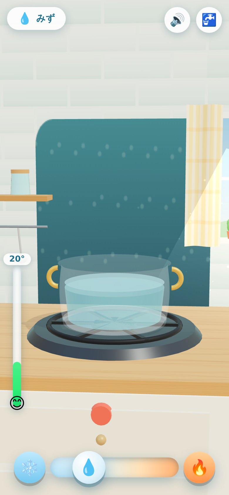
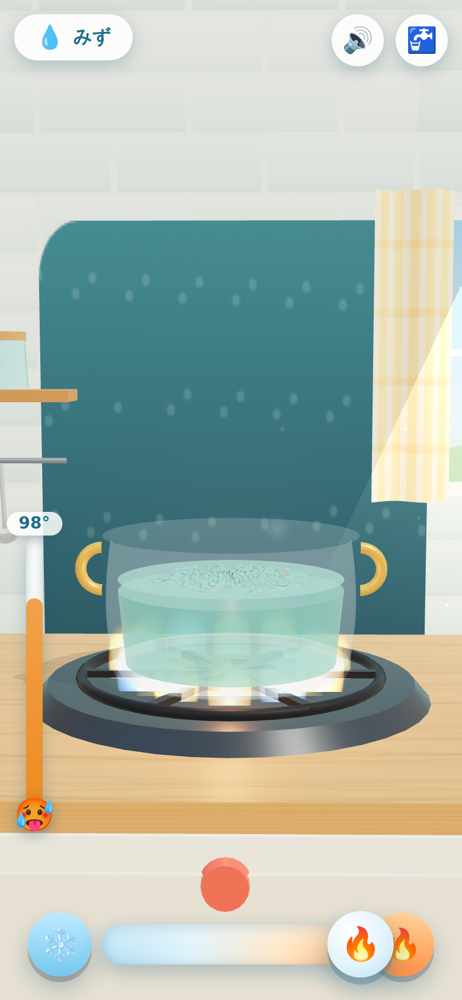
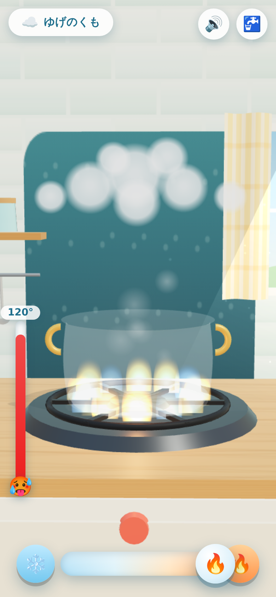
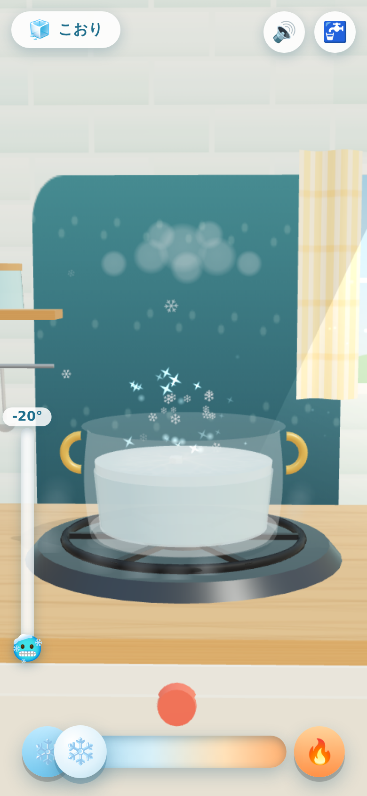
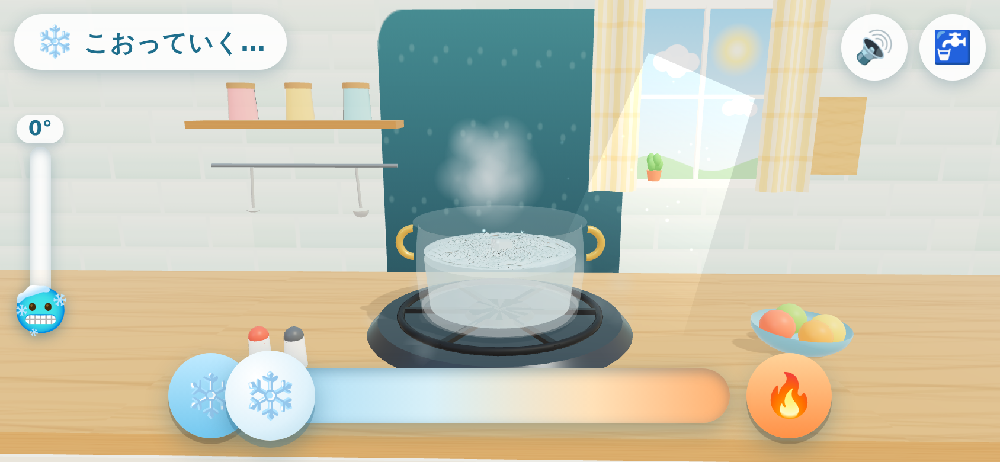

# みずのふしぎキッチン 🫧

**こおる・とける・わきあがる!** — Tinybop「States of Matter」風、
水の状態変化を指で触って学べる 3D サンドボックス。
4 歳児が iPhone / iPad の縦画面・横画面で遊ぶことを想定しています。



## あそびかた

- 下の **温度レバー** をスライド (❄️/🔥 ボタンでいっきに端まで)
- 🔥 **あたためる**: 泡がのぼり、100℃ でぐつぐつ沸騰。ゆげが立ちのぼり、なべの上に「くも」がたまる
- ❄️ **ひやす**: くもから雨が降ってみずが戻り、0℃ で氷キューブ → 霜のまく → かちかちの氷ブロックに
- 💧 **みずを なでる**: 波が立って水しぶきが飛ぶ
- 🧊 **こおりを タップ**: パキッとひび → 2 回でふたつに割れる
- ☁️ **ゆげを はらう**: 指でふわっと散らせる
- 🚰 ボタンでいつでも新しいみずに

本物の物理と同じく、**とけている間・こおっている間・沸騰している間は
温度計が 0℃ / 100℃ で止まります** (潜熱のプラトー)。
みずの量は こおり + みず + ゆげ で常に保存されます。

| ぐつぐつ | ゆげのくも | かちかち | よこ画面 |
|---|---|---|---|
|  |  |  |  |

## 実行

```bash
npm start   # python3 -m http.server 8000
# → http://localhost:8000 を iPhone/iPad の Safari か PC ブラウザで開く
```

ビルド不要・外部アセットなし (three.js は vendor/ に同梱、
テクスチャは canvas 生成、音は Web Audio 生成)。

## テスト

```bash
npm test
```

- `test/thermo-test.mjs` — 温度・状態変化モデルの単体テスト
  (全サイクル、保存則、0℃/100℃ プラトー、イベント発火)
- `test/smoke.mjs` — DOM シム上で本物のシーン部品を組み立て、
  沸騰→雨→全凍結→氷割り→融解 の全サイクルを数百フレーム回す
  ヘッドレステスト

## 構成

```
index.html        UI (タイトル・温度レバー・温度計・バナー) と CSS
src/main.js       レンダラ・環境マップ・カメラ・つなぎこみ
src/thermo.js     温度と状態変化のモデル (純ロジック)
src/watersim.js   水面の波シミュレーション (高さ場、純ロジック)
src/pot.js        ガラスなべ・水面 (極座標メッシュ) ・水のからだ
src/ice.js        氷キューブ・霜のまく・氷ブロック・タップで割る
src/steam.js      泡・ゆげ・くも・雨
src/effects.js    きらきら・しぶき・波紋・冷気・雪・ほこり
src/kitchen.js    キッチンの舞台 (壁・窓・コンロ・ほのお・小物)
src/audio.js      Web Audio の BGM と効果音
src/ui.js         DOM HUD のつなぎこみ
src/input.js      タッチ入力 (なでる・タップ・はらう)
```

## 技術メモ

- three.js r160 (vendor 同梱)、ES Modules、ビルド不要
- ガラスは transmission ではなくアルファ合成 + 環境マップ
  (transmission は透明な中身が見えなくなる & iOS で重いため)
- 水面はリング×セクターの極座標メッシュに波の高さ場を
  バイリニア補間で流し込み、毎フレーム法線を再計算
- fps が落ちる端末ではクリアコートと解像度を自動で下げる
- タッチ操作は `touch-action: none` + Pointer Events、
  セーフエリア (ノッチ) 対応
